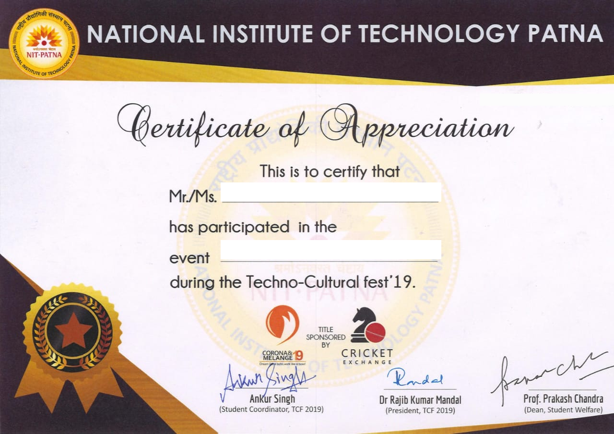
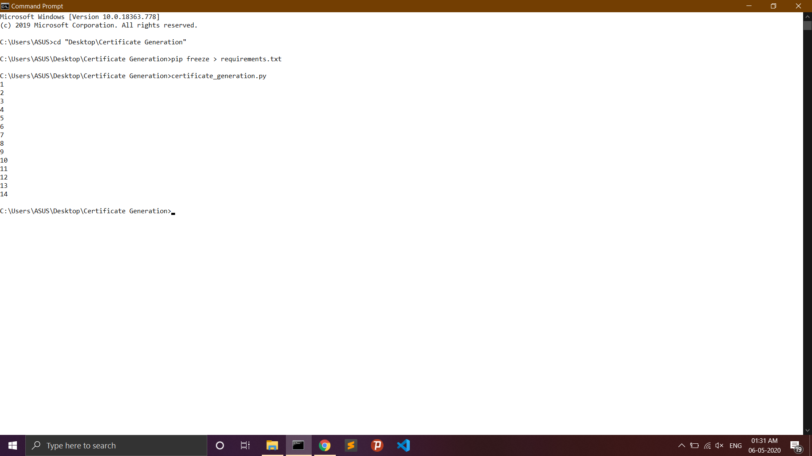
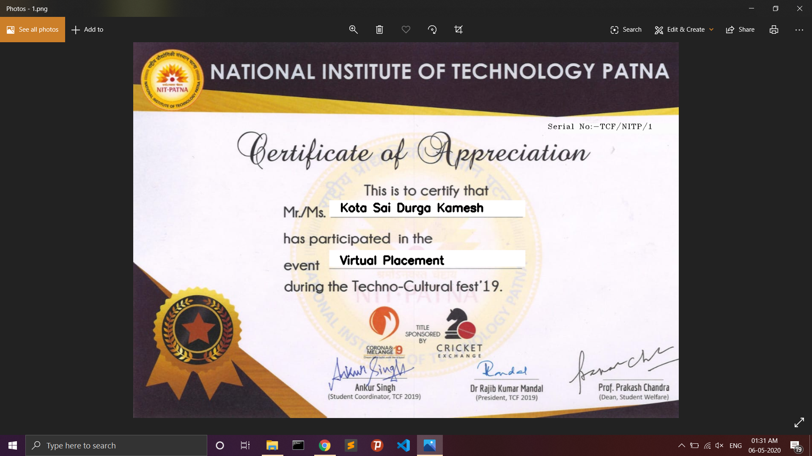

# Certificate Generation


<p align="center">
  <a href="https://github.com/ksdkamesh99/Certificate-Generation">
    
  </a>

## 📌 Introduction
Automatic Certificate Generation using opencv.
## 🎯 Purpose of the Project
As a Student of National Institute of Technology Patna , I usually participate in tech fest every year and at last I used to get Certificate of participation at end. I wondered how they 
automatically generate certificates for everyone for vast events each.So I thought to implement of my own by taking my certificate and edited it and generated the certificates using
python and opencv

## 🏁 Technology Stack

* [Python]()
* [OpenCV]()
* [Matplotlib]()
* [Numpy]()

## 🏃‍♂️ How to Use:

1. Drop a ⭐ on the Github Repository. 
2. Clone the Repo by going to your local Git Client and pushing in the command: 

```sh
https://github.com/ksdkamesh99/Certificate-Generation.git
```

3. Install the Packages: 
```sh
pip install -r requirements.txt
```
4.Update the dataset.csv file.  

5.At last, push in the command
```sh
certificate_generation.py
```

6.Go to certificate directory and check for the image and enjoy the application.  

7.Screenshots are being displayed in next section


## 📜 Screenshots:
* Folder which contins Certificates.  

* Command Prompt.  

* Final Image.  



## 📜 License:
[MIT](https://github.com/ksdkamesh99/Certificate-Generation/blob/master/LICENSE)
